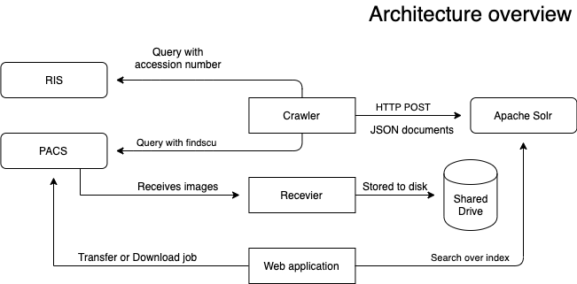

# Summary

Doing research with medical images, especially deep learning, it is important to find the right images for a given pathology. In a clinical setting all the medical images, are typically stored in a Picture Archiving and Communication Systems (PACS). These systems are single patient oriented and not suitable for research purposes. Another obstacle is that the medical findings are not stored with the images togehter in the PACS but rather in a Radiology Information System (RIS). The purpose of the PACS-RIS Crawler is to to provide a easy to use interface to search in the medical findings report and get the images which matches the report.

# Architecture / Implementation

The figure  shows the main components of the architecture and how the interact with each other. The PACS and RIS are usually are already present, [Apache Solr](http://lucene.apache.org/solr/) is used as the search database.

The application is split into three different parts:
 * crawler
 * web interface
 * recevier

## Crawler
The crawler is responsible for querying the PACS and the RIS and combining the information togehter. First it queries the PACS through the DICOM interface (findscu) for all given accession numbers for a given day. With this information the RIS is queried for the according report. Both of the information is merged into a single JSON document and then stored in Apache Solr.

## Web interface
To interact with the data stored in Apache Solr a web interface was build. This allows for researchers and doctors who are not comfortable with the command line to have an easy to use interface. Because the reports are indexed this allows for searching inside the report with full-text search capabilities. Search can include looking for specific keywords and/or combinations of it.

## Recevier
Once a search is refined and study exams have been found, they can be downloaded to a shared disk. From there it can be further processed with image processing tools, deep learning and so on.

# Acknowledgements

We acknowledge contributions from Manuela Moor, Ivan Nesic and Kevin Mader during the beginnings of this project.

